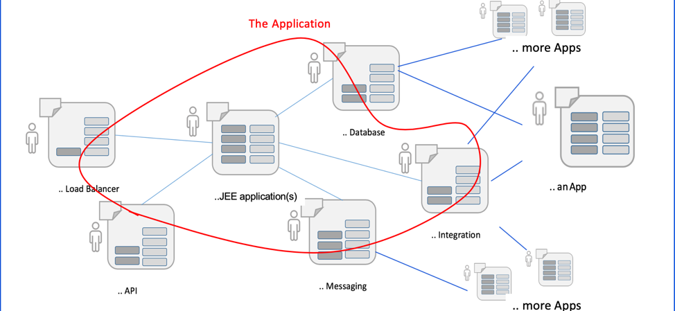
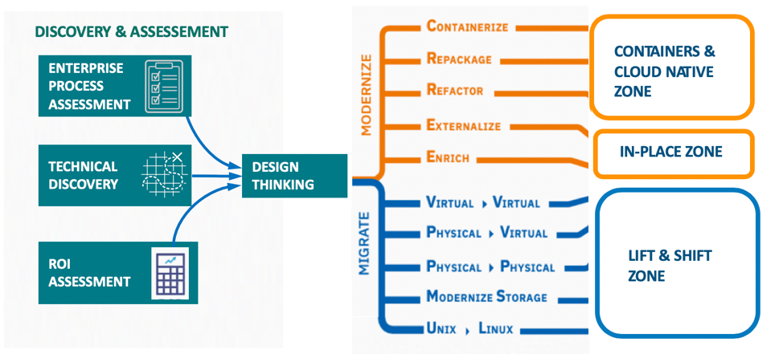

---
title: Application Modernization Overview
description: Moving your existing application workloads to leverage a modern cloud platform
---  

Application modernization transforms your existing applications to new approaches on the cloud. We assess your existing workloads, applications and underlying platform and make recommendations while moving towards easily managed systems in the future.

### What does Application Modernization actually mean?

First of all we have to start with a good definition of what we mean by an application. Making sure everyone understands what you&#39;re talking about is key to gaining the alignment on goals that we just discussed. It&#39;s odd that something so prevalent in the industry has been defined so variously, but part of that is due to the fact that the nature of applications have changed so much over the past fifty or so years of commercial application development.

Let&#39;s start by saying I don&#39;t mean that an application is &quot;just a program&quot;. That may have been true of some systems thirty years ago, but it&#39;s certainly not true of most enterprise systems today. As developers we like to think of &quot;the application&quot; as being our Java EAR files or WAR files, but that&#39;s only a small part of what the entire application actually consists of.

Instead, an application as I define it consists of one (but usually more) custom-written program components together with the supporting infrastructure, application middleware, middleware services (such as databases, queuing software, integration software and other aspects) and other components that make up a complete solution. It probably is deployed over several computers, either for scalability horizontally (the same component deployed multiple times) or vertically (the solution is split into multiple coordinating components). It may split itself across multiple geographical regions, or across multiple operating systems or computing architectures.

When you draw out all of these components, their dependencies, and the different systems that those all depend on and communicate with, what you end up is rarely the nice, neat, tree-like structure you see pictured in software engineering textbooks. Instead, it more often resembles a tangled hairball that may be extracted from a poorly-maintained bathroom sink.

And it&#39;s that distributed, multi-element nature that leads us to the second important definition:

_ **Application Modernization** __is the process of updating an application so that it can be maintained, extended, deployed and__ managed in a way that allows the application to meet the business&#39; current and future needs._

This is the key to the problem. We don&#39;t write applications in isolation - we write them as part of a surrounding ecosystem. Doing anything with an application like this requires you to not only understand all of these dependencies, but to plan for how to deal with each of the supporting components, in the right order. As a result, any change almost never happens all at once - this is an effort that takes not only planning, but time to execute.

### Why modernize? Some real reasons

There are many bad reasons for pursuing application modernization. You may be interested in it for a purely mercenary reason - because there&#39;s a new technology you want to put on your resume. You may do it because a vendor tells you it&#39;s the right thing to do (or worse, that it&#39;s fast and easy!) None of these are good reasons for going down the long modernization road. However, there are three things that we have seen that are good reasons for beginning the journey:

- You can&#39;t develop features at the pace your business requires - and it&#39;s the technology choices and architecture (and not your processes or team constraints) that is causing that.

- The architecture of your application is hindering you from being able to add functionality because of fragility (you can&#39;t test it) or constraints arising from technology choices.

- Your application is expensive to maintain and extend because either the infrastructure is excessively costly (for instance, older versions of middleware that require special support contracts) or the skills required are too expensive to find and maintain.

If you are in any of these situations, then application modernization may be a good match for you. Once you&#39;ve made the decision to start in the right direction, the next question is how you keep moving in that direction.

### How do you succeed? Follow the proven path

Before we look at the modernization journey, let&#39;s consider the application current state. The key here is that there will be some applications that will NEVER leave their current state. There are several reasons why this would be true.

- The application may have a limited lifetime. If you are going to retire an application, then there is no need to modernize it.
- The application may be replaceable by SaaS. If the application (at least in its current form) can be entirely replaced by a SaaS application, then in many cases that is the simplest and easiest route.
- The application may be one that is supported by a vendor or third party ISV that is resistant or even hostile to changing their implementation, automation or management. If that is true, then that should be a reason to start looking for other alternatives (SaaS or other…)

We would hope that the number of applications that fall into this category are small, but realistically, the number can be large. For companies that consider themselves to be &quot;technology companies&quot; this figure may be in the low double digits, perhaps 20-30%. However, for companies that explicitly do not consider IT to be part of their business competency (as often evidenced by large outsourcing contracts and wide reliance on packaged software) the number can be quite large - we have seen up to 80% in some companies that are part of mature industries. When costs savings becomes the driving force in IT and completely subsumes innovation, then this end state is nearly inevitable. When that is true, that may be an indication that this particular company, or perhaps the entire industry, is ripe for disruption.

Let&#39;s take a look at the high level map of our modernization journey:

The first part is Discovery and Assessment phase that consists of 3 steps described below. These steps are loosely coupled and are often executed in parallel. The outputs of all 3 steps are inputs for the Design Thinking workshop, a critical part of the modernization journey which shapes the rest of the way ahead.

#### Enterprise process assessment

Almost invariably, an impact of change expected to be caused by application modernization to an organization requires proactive system type design to ensure the change will last. It is essential for success that people welcome the change and choose to engage in new processes and use new technologies to achieve their desired outcomes. The organization leadership must inspire autonomy and ownership through a clear vision, modeling desirable behaviors, and giving people permission to change. Continued growth requires vision, everyone needs to see where they are going and understand why. To design organizational change as a system fit for purpose of successful modernization journey, we use proven IBM Garage Design Thinking method.

A different type of &quot;people&quot; issues is related to existing organizational capabilities and whether they are ready to support application modernization journey. A typical IT organization today is often focused on &#39;keeping the lights on&#39; for a mostly stabilized application portfolio. Existing organizational capabilities have matured over years, and you may not think about a need of a fresh look when your organization is directed to start application modernization efforts.

Enterprise process assessment is a structured approach in application modernization context to discover implicit gaps in organizations capabilities related to application modernization by double checking important assumptions and overcoming groupthink. This drives a collaborative effort to provide actionable recommendations to refresh processes and practices in the client organization essential for modernization journey success.

The methodology and tools used in Enterprise process assessment are described here: **LINK**

#### Technical discovery

Technical discovery captures key characteristics of the target application modernization portfolio to help determine the type of work involved e.g. migrate, modernize etc., and estimate of the effort required. Discovery is based on using separate tools for different stages of discovery, followed by face-to-face Assessment workshop.

The biggest challenge with technical discovery is lack of easy access to desired level of information about target application portfolio which is spread between various systems of record such as CMDB, various groups and SMEs, and in many cases such information is fragmented and incomplete.

Generally technical discovery tools and methods land in 2 groups.

- Breadth oriented discovery tools that are more oriented on establishing the nomenclature of the applications and their components, as well as application dependencies. These tools are useful to determine candidate &quot;move groups&quot; of workloads for cloud migrations to preserve affinity of tightly coupled application components. This type of discovery usually does not focus on technical details of application components and middleware specific modernization aspects. These tools allow to determine &quot;desired&quot; modernization target dispositions, e.g. &quot;I want to containerize this application&quot;
- Depth oriented discovery tools that are able to introspect specific application components based on underlying technology and provide deeper insight into feasibility, potential issues and effort estimates for specific modernization targets, e.g. &quot;This is what will take to containerize this application, and here are the impediments to overcome that will take X timeframe&quot;

The description of Technical discovery tools and relevant methods are provided here **LINK**

#### ROI Assessment
Lorem ipsum