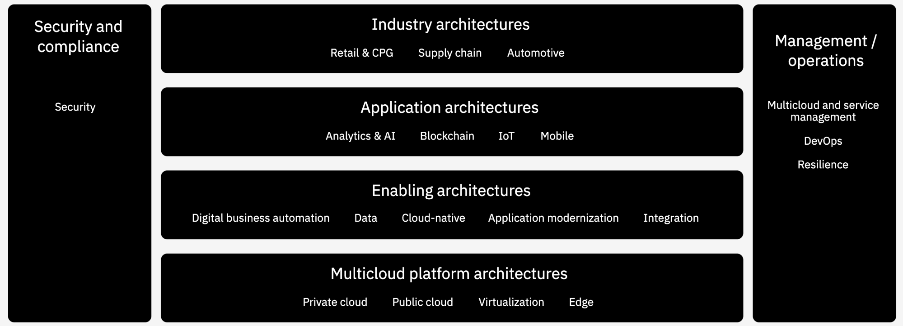

export const Title = () => (
  
Architecture and Technology Playbook for Container Platform   <h3>Move towards cloud-native aproaches</h3>
  
);

<PageDescription>
Move towards cloud-native, leveraging what you already have.  Notes based on field experiences from the IBM Garage for Cloud for modernizing your applications, integrations and establishing a platform to take advantage of a Cloud approach.
</PageDescription>

### How do you succeed? Follow the proven path

