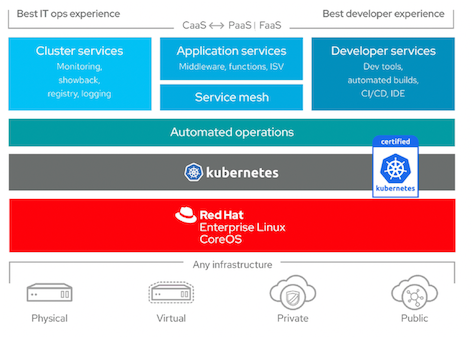

OpenShift Container Platform is a platform for developing and running containerized applications. It is designed to allow applications and the data centers that support them to expand from just a few machines and applications to thousands of machines that serve millions of clients.

