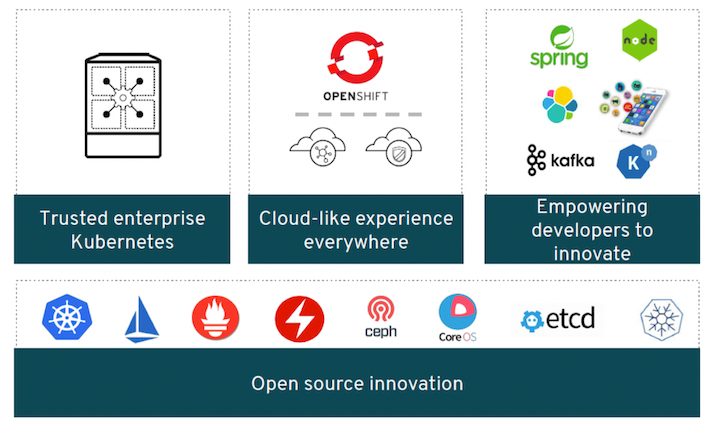

Emerging software applications are making use of containerization to enable rapid prototyping, testing, as well
deployment to the cloud. The micro-service revolution introduced container-based virtualization, which offers
many benefits when compared to traditional virtualization technologies. Containers provide a more portable
and faster way to deploy services on cloud infrastructures compared to virtualization.   

While containers themselves provide many benefits, they are not easily manageable in large environments.
Hence, many container orchestration tools have increased in momentum and gained popularity. Each
orchestration tool is different; hence they should be chosen individually for specific purposes. The Red Hat
OpenShift® Container Platform uses Kubernetes which is an orchestration framework based on containerdeployment practices. Kubernetes has gained popularity in the cloud community due to its maturity, scalability,
performance, and many built-in tools that enable production-level container workload orchestration. 

